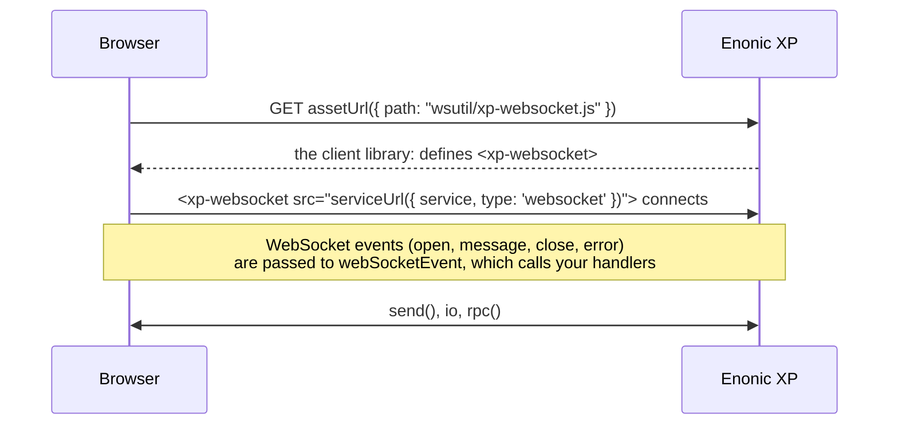

# Enonic XP websocket utility library

Make WebSocket integration with Enonic XP easy and more dynamic.

WebSockets are a powerful tool for real time communication between client and server, but both the server side
and the client side need some code to get started. This library reduces that code to a few lines, and adds
features on top of XP's own `/lib/xp/websocket`.

Some use-cases for WebSockets:

- Real time chat
- IoT data flow
- WebRTC peer-to-peer signaling
- Real time server notifications
- Search suggestions while typing

## Features

- The connection is an element: `<xp-websocket src="...">` connects when it is added to the page, and dispatches the
  WebSocket events as DOM events.
- Send objects, not only strings. They are serialized to JSON, and parsed on the other side.
- [Rpc](server.md#rpc): methods you write on the server, called from the client as typed async functions.
- A main handler and any number of additional handlers for each WebSocket event.
- [`SocketEmitter`](server.md#socketemitter) and [`io`](client.md#io): named events between server and client,
  inspired by [socket.io](https://socket.io/).
- Groups with automatic creation, a user list, and automatic removal when a user disconnects.
- [Extensions](extensions.md) to reuse functionality on both the server and the client.
- Several independent websocket services in one app, each with its own handlers, groups, emitter and rpc methods.

## How it works

A WebSocket connection in Enonic XP is handled by a *service*. `createWebSocketService()` gives the service
controller its two handlers: `get` accepts the connections, and `webSocketEvent` passes the WebSocket events
(`open`, `message`, `close`, `error`) to the handlers you register, and answers rpc calls.

The client side library is an asset of your app, `assets/wsutil/xp-websocket.js`, which the library brings along and
[lib-asset](https://developer.enonic.com/docs/lib-asset/stable) serves. It defines the `<xp-websocket>` element. A page loads the script and adds the element with the URL of the service,
and the element keeps the connection while it is in the page.

## Contents

- [Installation](../README.md#installation) and [a minimal example](../README.md#hello-sockets)
- [Server API](server.md): `createWebSocketService()` from `/lib/wsutil`, used in your service controller
- [Client API](client.md): the `<xp-websocket>` element, used in the browser
- [Creating extensions](extensions.md): reusable functionality for the server and the client
- [Tutorial](tutorial.md): build a chat application, step by step
- [Migrating from 2.x to 3.0](migrating-to-3.md): every change that affects an app built on 2.x

The full type definitions, with documentation for every function, are published to npm as
[`@item-enonic-types/lib-wsutil`](https://www.npmjs.com/package/@item-enonic-types/lib-wsutil), so your editor shows
them as you type.
