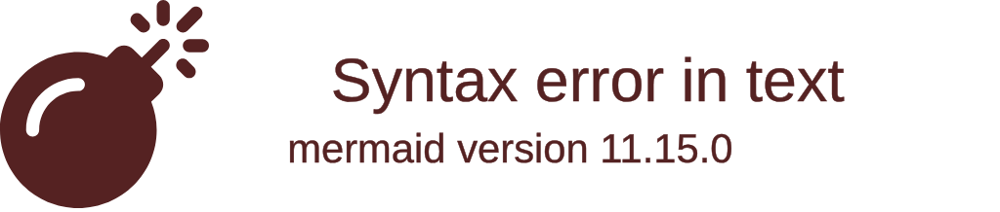

# Tutorial: a chat application

In this tutorial we build a chat application with Enonic XP 8 and this library: a global chat, a list of the
users, and private messages between two users.

We use a page, a service and a few lines of client side JavaScript:



## Set up

Start with an app created from the TypeScript starter
([starter-ts](https://github.com/enonic/starter-ts)), and follow the [installation](../README.md#installation)
steps:

```groovy
dependencies {
  include "no.item:lib-xp-wsutil:3.0.0"
  include "no.item:lib-xp-freemarker:4.0.0"
}
```

The page below renders its view with [lib-xp-freemarker](https://github.com/ItemConsulting/lib-xp-freemarker), and
links its assets with [lib-asset](https://developer.enonic.com/docs/lib-asset/stable), which the starter includes.

### The service

The service handles the WebSocket connections:

```typescript
// services/websocket/websocket.ts
import { createWebSocketService } from "/lib/wsutil";

const socket = createWebSocketService();
export const { get, webSocketEvent } = socket;
```

### The page

The page descriptor:

```yaml
# cms/pages/chat/chat.yaml
kind: "Page"
title: "Chat"
form: []
```

The page controller renders `chat.ftlh`, with three URLs in the model: the client side library, which is an asset of
the app, the WebSocket URL of the service, and our own client side code, `assets/chat.js`, which is empty for now:

```typescript
// cms/pages/chat/chat.ts
import type { Response } from "@enonic-types/core";
import { render } from "/lib/freemarker";
import { assetUrl } from "/lib/enonic/asset";
import { serviceUrl } from "/lib/xp/portal";

const view = resolve("chat.ftlh");

export function get(): Response {
  const model = {
    clientUrl: assetUrl({ path: "wsutil/xp-websocket.js" }),
    socketUrl: serviceUrl({ service: "websocket", type: "websocket" }),
    chatUrl: assetUrl({ path: "chat.js" }),
  };

  return {
    body: render(view, model),
  };
}
```

The page loads the library and our script, and adds an `<xp-websocket>` element, which connects to the service:

```ftlh
[#-- cms/pages/chat/chat.ftlh --]
[#-- @ftlvariable name="clientUrl" type="String" --]
[#-- @ftlvariable name="socketUrl" type="String" --]
[#-- @ftlvariable name="chatUrl" type="String" --]
<!DOCTYPE html>
<html lang="en">
<head>
  <meta charset="utf-8">
  <title>Hello Sockets</title>
  <script type="module" src="${clientUrl}"></script>
  <script type="module" src="${chatUrl}"></script>
</head>
<body>
  <xp-websocket src="${socketUrl}"></xp-websocket>
</body>
</html>
```

Module scripts run after the page is parsed, in order, so `chat.js` finds the element in the page, already defined
by the library.

Deploy the app, add it to a site in Content Studio, and select the *Chat* page for the site. Open the page, and the
server log shows the `open` event of the connection, when debug logging is enabled for the app. In the browser,
`document.querySelector("xp-websocket").connected` is `true`.

Both sides are now ready to talk to each other.

## Registering a username

We use the [`SocketEmitter`](server.md#socketemitter) of the service on the server and [`io`](client.md#io) on the client, which send
*named events* back and forth.

The page gets a registration form, and two containers that stay hidden until the user has registered:

```ftlh
<div id="register">
  <input type="text" id="username" placeholder="Username">
  <button id="register-button">Register</button>
</div>
<div id="global" hidden>
  <textarea id="chat" cols="40" rows="10" readonly></textarea>
  <select id="users" size="10"></select>
  <input type="text" id="chat-input" placeholder="Message everyone">
</div>
<div id="private" hidden>
  <textarea id="private-chat" cols="40" rows="10" readonly></textarea>
  <select id="private-users" size="10"></select>
  <input type="text" id="private-input" placeholder="Message privately">
</div>
```

On the client, the *Register* button emits a `username-registration` event, and the server answers with a
`username-response` event. The client code, in `assets/chat.js`, gets `io` from the element:

```javascript
// assets/chat.js
const socket = document.querySelector("xp-websocket");
const io = socket.io;

const $ = (id) => document.getElementById(id);

let username = ""; // Our username, once registered
let pendingUsername = "";

$("register-button").addEventListener("click", () => {
  pendingUsername = $("username").value.trim();

  if (pendingUsername) {
    io.emit("username-registration", pendingUsername);
  } else {
    alert("Please enter a valid username");
  }
});

io.on("username-response", (response) => {
  if (response === "ok") {
    username = pendingUsername;
    $("register").hidden = true;
    $("global").hidden = false;
  } else {
    alert(`Username is ${response}`);
  }
});
```

On the server, the service keeps the registered users, and the connection callback remembers the username of each
client:

```typescript
// services/websocket/websocket.ts
import { createWebSocketService } from "/lib/wsutil";

const socket = createWebSocketService();
export const { get, webSocketEvent } = socket;

const socketEmitter = socket.emitter();

// The session ids of the registered users, by username
const users: Record<string, string> = {};

socketEmitter.connect((socket) => {
  let username: string | undefined; // The username of this client, once registered

  socket.on("username-registration", (name: string) => {
    if (users[name]) {
      socket.emit("username-response", "taken");
      return;
    }

    username = name;
    users[username] = socket.id;
    socket.emit("username-response", "ok");

    // Tell every client that a new user has joined
    socketEmitter.broadcast("user-enter", username);
  });
});
```

The service module is loaded once, so `users` is shared by every connection to it.

## Chatting

When enter is pressed in the chat input, the client emits a `public-message` event:

```javascript
function addLine(textarea, line) {
  textarea.value += `${line}\n`;
  textarea.scrollTop = textarea.scrollHeight;
}

$("chat-input").addEventListener("keydown", (event) => {
  const input = event.target;

  if (event.key === "Enter" && input.value) {
    io.emit("public-message", input.value);
    input.value = "";
  }
});

io.on("public-message", (message) => addLine($("chat"), `${message.username}: ${message.content}`));
```

The server broadcasts it to every client, together with the username of the sender. The server adds the username
itself, so no one can send messages in someone else's name:

```typescript
socketEmitter.connect((socket) => {
  // ...

  socket.on("public-message", (content: string) => {
    if (username) {
      socketEmitter.broadcast("public-message", { username, content });
    }
  });
});
```

Note that `broadcast()` is called on `socketEmitter`, to send to every client, and `emit()` on `socket`, to send to
this client only.

Redeploy, open the page in a few browser tabs, and register a user in each. That's a chat.

## The user list

Every client is told when a user joins, and adds the user to its list:

```javascript
function addUser(user) {
  const option = document.createElement("option");
  option.value = user;
  option.textContent = user;
  $("users").append(option);
}

io.on("user-enter", (user) => {
  addLine($("chat"), `Server: ${user} has joined the chat`);
  addUser(user);
});
```

But a new user doesn't know about the users who joined before them. So the server sends them a message of the day,
with the users already in the chat, before telling everyone about the new user:

```typescript
socket.on("username-registration", (name: string) => {
  if (users[name]) {
    socket.emit("username-response", "taken");
    return;
  }

  socket.emit("motd", { motd: "Welcome to our chat!", users: Object.keys(users) });

  username = name;
  // ... as before
});
```

```javascript
io.on("motd", ({ motd, users }) => {
  $("chat").value = `${motd}\n`;
  $("users").replaceChildren(); // Forget the users seen before registering
  users.forEach(addUser);
});
```

When a user closes the page, the user stays in every list. the `SocketEmitter` calls the client's `onDisconnect()`
callback when a client disconnects, so the server can tell the others:

```typescript
socket.onDisconnect(() => {
  if (username) {
    delete users[username];
    socketEmitter.broadcast("user-leave", username);
  }
});
```

```javascript
io.on("user-leave", (user) => {
  addLine($("chat"), `Server: ${user} has left the chat`);
  [...$("users").options].find((option) => option.value === user)?.remove();
});
```

## Private messages

A private chat starts when a user double clicks another user in the list. Each conversation has its own log, and
the one shown is the one with the *context user*:

```javascript
const privateLogs = new Map(); // The private chat logs, by username
let contextUser; // The user we are talking to at the moment

function openPrivateChat(user) {
  $("private").hidden = false;

  if (!privateLogs.has(user)) {
    privateLogs.set(user, `Chatting with ${user}\n`);

    const option = document.createElement("option");
    option.value = user;
    option.textContent = user;
    option.addEventListener("click", () => showPrivateChat(user));
    $("private-users").append(option);
  }

  if (!contextUser) showPrivateChat(user);
}

function showPrivateChat(user) {
  contextUser = user;
  $("private-chat").value = privateLogs.get(user);
  $("private-chat").scrollTop = $("private-chat").scrollHeight;
}

function addPrivateLine(user, line) {
  privateLogs.set(user, `${privateLogs.get(user)}${line}\n`);
  if (contextUser === user) showPrivateChat(user);
}
```

Opening a private chat on double click is added to `addUser()`:

```javascript
function addUser(user) {
  const option = document.createElement("option");
  option.value = user;
  option.textContent = user;
  option.addEventListener("dblclick", () => {
    openPrivateChat(user);
    showPrivateChat(user);
  });
  $("users").append(option);
}
```

Sending and receiving private messages works like the global chat:

```javascript
$("private-input").addEventListener("keydown", (event) => {
  const input = event.target;

  if (event.key === "Enter" && input.value && contextUser) {
    io.emit("private-message", { to: contextUser, content: input.value });
    addPrivateLine(contextUser, `${username}: ${input.value}`);
    input.value = "";
  }
});

io.on("private-message", (message) => {
  openPrivateChat(message.username);
  addPrivateLine(message.username, `${message.username}: ${message.content}`);
});
```

The server looks up the session id of the recipient, and sends the message on with `emitTo()`:

```typescript
socket.on("private-message", (message: { to: string; content: string }) => {
  const recipient = users[message.to];

  if (username && recipient) {
    socketEmitter.emitTo(recipient, "private-message", { username, content: message.content });
  }
});
```

And that's it, the chat is finished!

Now it is your turn: add chat rooms. [Groups](server.md#groups) are a good place to start. Good luck!

## The complete code

```typescript
// services/websocket/websocket.ts
import { createWebSocketService } from "/lib/wsutil";

const socket = createWebSocketService();
export const { get, webSocketEvent } = socket;

const socketEmitter = socket.emitter();

// The session ids of the registered users, by username
const users: Record<string, string> = {};

socketEmitter.connect((socket) => {
  let username: string | undefined; // The username of this client, once registered

  socket.on("username-registration", (name: string) => {
    if (users[name]) {
      socket.emit("username-response", "taken");
      return;
    }

    socket.emit("motd", { motd: "Welcome to our chat!", users: Object.keys(users) });

    username = name;
    users[username] = socket.id;
    socket.emit("username-response", "ok");

    // Tell every client that a new user has joined
    socketEmitter.broadcast("user-enter", username);
  });

  socket.on("public-message", (content: string) => {
    if (username) {
      socketEmitter.broadcast("public-message", { username, content });
    }
  });

  socket.on("private-message", (message: { to: string; content: string }) => {
    const recipient = users[message.to];

    if (username && recipient) {
      socketEmitter.emitTo(recipient, "private-message", { username, content: message.content });
    }
  });

  socket.onDisconnect(() => {
    if (username) {
      delete users[username];
      socketEmitter.broadcast("user-leave", username);
    }
  });
});
```

```yaml
# cms/pages/chat/chat.yaml
kind: "Page"
title: "Chat"
form: []
```

```typescript
// cms/pages/chat/chat.ts
import type { Response } from "@enonic-types/core";
import { render } from "/lib/freemarker";
import { assetUrl } from "/lib/enonic/asset";
import { serviceUrl } from "/lib/xp/portal";

const view = resolve("chat.ftlh");

export function get(): Response {
  const model = {
    clientUrl: assetUrl({ path: "wsutil/xp-websocket.js" }),
    socketUrl: serviceUrl({ service: "websocket", type: "websocket" }),
    chatUrl: assetUrl({ path: "chat.js" }),
  };

  return {
    body: render(view, model),
  };
}
```

```ftlh
[#-- cms/pages/chat/chat.ftlh --]
[#-- @ftlvariable name="clientUrl" type="String" --]
[#-- @ftlvariable name="socketUrl" type="String" --]
[#-- @ftlvariable name="chatUrl" type="String" --]
<!DOCTYPE html>
<html lang="en">
<head>
  <meta charset="utf-8">
  <title>Hello Sockets</title>
  <script type="module" src="${clientUrl}"></script>
  <script type="module" src="${chatUrl}"></script>
</head>
<body>
  <xp-websocket src="${socketUrl}"></xp-websocket>

  <div id="register">
    <input type="text" id="username" placeholder="Username">
    <button id="register-button">Register</button>
  </div>
  <div id="global" hidden>
    <textarea id="chat" cols="40" rows="10" readonly></textarea>
    <select id="users" size="10"></select>
    <input type="text" id="chat-input" placeholder="Message everyone">
  </div>
  <div id="private" hidden>
    <textarea id="private-chat" cols="40" rows="10" readonly></textarea>
    <select id="private-users" size="10"></select>
    <input type="text" id="private-input" placeholder="Message privately">
  </div>

</body>
</html>
```

```javascript
// assets/chat.js
const socket = document.querySelector("xp-websocket");
const io = socket.io;

const $ = (id) => document.getElementById(id);

let username = ""; // Our username, once registered
let pendingUsername = "";

const privateLogs = new Map(); // The private chat logs, by username
let contextUser; // The user we are talking to at the moment

function addLine(textarea, line) {
  textarea.value += `${line}\n`;
  textarea.scrollTop = textarea.scrollHeight;
}

function addUser(user) {
  const option = document.createElement("option");
  option.value = user;
  option.textContent = user;
  option.addEventListener("dblclick", () => {
    openPrivateChat(user);
    showPrivateChat(user);
  });
  $("users").append(option);
}

function openPrivateChat(user) {
  $("private").hidden = false;

  if (!privateLogs.has(user)) {
    privateLogs.set(user, `Chatting with ${user}\n`);

    const option = document.createElement("option");
    option.value = user;
    option.textContent = user;
    option.addEventListener("click", () => showPrivateChat(user));
    $("private-users").append(option);
  }

  if (!contextUser) showPrivateChat(user);
}

function showPrivateChat(user) {
  contextUser = user;
  $("private-chat").value = privateLogs.get(user);
  $("private-chat").scrollTop = $("private-chat").scrollHeight;
}

function addPrivateLine(user, line) {
  privateLogs.set(user, `${privateLogs.get(user)}${line}\n`);
  if (contextUser === user) showPrivateChat(user);
}

$("register-button").addEventListener("click", () => {
  pendingUsername = $("username").value.trim();

  if (pendingUsername) {
    io.emit("username-registration", pendingUsername);
  } else {
    alert("Please enter a valid username");
  }
});

$("chat-input").addEventListener("keydown", (event) => {
  const input = event.target;

  if (event.key === "Enter" && input.value) {
    io.emit("public-message", input.value);
    input.value = "";
  }
});

$("private-input").addEventListener("keydown", (event) => {
  const input = event.target;

  if (event.key === "Enter" && input.value && contextUser) {
    io.emit("private-message", { to: contextUser, content: input.value });
    addPrivateLine(contextUser, `${username}: ${input.value}`);
    input.value = "";
  }
});

io.on("username-response", (response) => {
  if (response === "ok") {
    username = pendingUsername;
    $("register").hidden = true;
    $("global").hidden = false;
  } else {
    alert(`Username is ${response}`);
  }
});

io.on("motd", ({ motd, users }) => {
  $("chat").value = `${motd}\n`;
  $("users").replaceChildren(); // Forget the users seen before registering
  users.forEach(addUser);
});

io.on("user-enter", (user) => {
  addLine($("chat"), `Server: ${user} has joined the chat`);
  addUser(user);
});

io.on("user-leave", (user) => {
  addLine($("chat"), `Server: ${user} has left the chat`);
  [...$("users").options].find((option) => option.value === user)?.remove();
});

io.on("public-message", (message) => addLine($("chat"), `${message.username}: ${message.content}`));

io.on("private-message", (message) => {
  openPrivateChat(message.username);
  addPrivateLine(message.username, `${message.username}: ${message.content}`);
});
```
