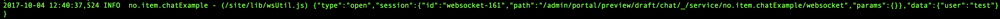

## Tutorial ##

In this tutorial we will create a simple chat application with EnonicXP and the websocket utility library.
For this tutorial we will have our base vanilla starter project at `/path/to/chatExample`

We will be using a page component, a service component and a static JS file.

.../resources
* /assets
    * socket.js
* /services
    * /websocket
        * websocket.js
* /site
    * /pages
        * /chat
            * chat.js
            * chat.html
            
            
### Set up ###
Lets start easy, open the chat.js file

```javascript
var thymeleaf = require('/lib/xp/thymeleaf'); // Import the thymeleaf library
var portal = require('/lib/xp/portal');       // Import the portal library

// Handle the GET request
exports.get = function(req) {

    // Specify the view file to use
    var view = resolve('chat.html');
    
    var model ={ 
        client: portal.assetUrl({ path: 'socket.js'}), // Create a reference to our client side websocket script
        lib: portal.serviceUrl({service: 'websocket'}) // Create a reference to our server side websocket script
    };

    // Render HTML from the view file

    var body = thymeleaf.render(view, model);

    // Return the response object
    return {
        body: body
    }
};
```           
Now we will open our chat.html

```html
<!DOCTYPE html>
<html>
<head>
    <title>Hello Sockets</title>
</head>
<body data-portal-component-type="page">

    <!-- We need to import our lib reference first -->
    <script data-th-src="${lib}"></script>
    <script data-th-src="${client}"></script>
</body>
</html>
```     

Lets set up our server side implementation in our websocket service

```javascript
var ws = require('/lib/wsUtil'); // Import our websocket utility library

ws.openWebsockets(exports);      // Make the server ready for socket connections
```

Now initiate the client source script in our socket.js file

```javascript
var cws = new EnonicXP.Ws();
cws.connect();
```

Add the dependencies to the `build.gradle` file

```
include "com.enonic.xp:lib-io:${xpVersion}"
include "com.enonic.xp:lib-websocket:${xpVersion}"
include "no.item.wsUtil:wsUtil:0.0.1"
```

Now we are ready to deploy

Add your application in content studio and preview your application

In your inspector console there will, hopefully, be a websocket event object being printed


And also in our server console



If the client event is of type open, then we have an active socket connection

The reason this is being printed to console is because of the default handlers for both client and server prints all events to console.

Now both sides are set up to have socket communication with each other

### The logic and the parts ###

We are done with our controller but we need some elements for our view.
```html
<div id="global"></div>
<div id="private"></div>
<div id="rooms"></div>
```

**global** Here we will place our global elements which will be our main chat channel where everybody lands when they connect

**private** Will be our container for person to person chat

**rooms** This will be our place for this tutorial´s assignment. You have to create the logic and the parts for this container

#### Global ####

Lets have some input fields for our global container

```html
<textarea name="textArea" id="chat" cols="30" rows="10" readonly></textarea>
<select name="users" id="usernames" size="10" style="width: 10%"></select>
<input type="text" id="text-input">
```

The text area tag will be our chat message screen, thats why it is readonly.<br>
The select tag will be our user list.<br>
The input tag will be our chat input field

Ok so we have our basic chat elements, but we also need something to register a username. Lets add them before we apply our logic

```html
<textarea name="textArea" id="chat" cols="30" rows="10" readonly></textarea>
<select name="users" id="usernames" size="10" style="width: 10%"></select>
<input type="text" id="text-input">
<input type="text" id="username">
<button id="ubutton">Register</button>
```

Right now let apply some client side logic. For this project we will use the socket emitter expansion

```javascript
// socket.js

var cws = new EnonicXP.Ws();
// ws.connect(); We don't need this because our Io instance handles this
var io = new cws.Io();

// declare our variables and initialize
var textArea;
var textInput;
var usernames;
var usernameInput;
var ubutton;
var username = '';

init();

function init() {
  textArea        = document.getElementById('chat');
  textInput       = document.getElementById('text-input');
  usernames       = document.getElementById('usernames');
  usernameInput   = document.getElementById('username');
  ubutton         = document.getElementById('ubutton');
}
```

Ok so we don't want any anonymous users listening on the chat without being a part of the chat

Lets hide the chat until the user register his username

```javascript
function init() {
  textArea        = document.getElementById('chat');
  textInput       = document.getElementById('text-input');
  usernames       = document.getElementById('usernames');
  usernameInput   = document.getElementById('username');
  ubutton         = document.getElementById('ubutton');
  
  usernames.style.visibility  = 'hidden';
  textArea.style.visibility   = 'hidden';
  textInput.style.visibility  = 'hidden';
}
```
Ok so our global chat elements are in place and referenced. Now we will add the register username functionality

We need to do this when user click the register button

```javascript
function init() {
  textArea        = document.getElementById('chat');
  textInput       = document.getElementById('text-input');
  usernames       = document.getElementById('usernames');
  usernameInput   = document.getElementById('username');
  ubutton         = document.getElementById('ubutton');
  
  usernames.style.visibility  = 'hidden';
  textArea.style.visibility   = 'hidden';
  textInput.style.visibility  = 'hidden';
  
  ubutton.onclick = function() {
    // lets check if it is a valid username
    if (usernameInput.value !== '') {
        // Lets ask the server for username validation
        // We will user the emit function
        io.emit('username-registration', usernameInput.value);
        // No register a response handler
        io.on('username-response', function(response) {
          if (response === 'ok') {
              // Ok so our username is valid, we should store it somewhere
              username = usernameInput.value;
              // This also means that we can show our chat and hide our registration
              usernameInput.style.visibility  = 'hidden';
              ubutton.style.visibility        = 'hidden';
              textArea.style.visibility       = 'visible';
              textInput.style.visibility      = 'visible';
              usernames.style.visibility      = 'visible';
          }
          else {
              // Lets show why it failed
              alert('Username is ' + response);
          }
        })
    }
    else {
        alert('Please enter a valid username');
    }
  }
}

```

Alright, now we will do some server side stuff

```javascript
// /service/websocket/websocket.js

var ws = require('/lib/wsUtil'); // Import our websocket utility library

ws.openWebsockets(exports);      // Make the server ready for socket connections

// We will use our SocketEmitter expansion to handle this

var socketEmitter = new ws.SocketEmitter();

// Lets keep a reference of connected users
var users = {};

// Now we will handle socket connections

socketEmitter.connect(connectionCallback);

function connectionCallback(socket) {
    socket.on('username-registration', function(username) { // Register username
            if (!users[username]) {              // if not taken
                users[username] = socket.id;       // Register the new user
                socket.emit('username-response', 'ok');     // Tell the client that username is ok
                socketEmitter.broadcast('user-enter', username); // Tell all clients that a new user has entered the chat
            }
            else {                              // if taken
                socket.emit('username-response', 'taken'); // Tell the client to chose again
            }
        });
}

```

Ok so now our server will check for availability and register new users if not taken, but the server also emits an 'user-enter' event when the registration is ok. We need to handle this on the client side

```javascript
// socket.js

io.on('user-enter', function (user) {
    textArea.innerHTML += '\nServer--> ' + user + ' has joined the chat'; // Add the message from server
    createNewUser(user); // we need to create a new user for our user list
});

// So what we do is to create a new option tag with value and id attributes with the users username
function createNewUser(user) {
    var newUser = document.createElement('OPTION');
        newUser.setAttribute('id', user);
        newUser.setAttribute('value', user);
        newUser.appendChild(document.createTextNode(user));
        usernames.appendChild(newUser);
}

```

Now redeploy and check out our application

Looks pretty nice with our nice username and stuff. But it is not a chat yet.

The next step is to add a on key down handler for our input field and send some chat messages about

```javascript
// socket.js

function init() {
    textArea        = document.getElementById('chat');
    textInput       = document.getElementById('text-input');
    usernames       = document.getElementById('usernames');
    usernameInput   = document.getElementById('username');
    ubutton         = document.getElementById('ubutton');
      
    usernames.style.visibility  = 'hidden';
    textArea.style.visibility   = 'hidden';
    textInput.style.visibility  = 'hidden';
  
    ubutton.onclick = onButtonClick; // We can make this nicer
    textInput.onkeydown = onInputDown;    
}

function onInputDown(event) {
    // Check if enter is pressed in input field 
  if (event.keyCode === 13 && username) {
      event.preventDefault();
      
      // Send a public message if there is anything to send. Add the username and content to the message
      if (textInput.value !== '') io.emit('public-message', {username: username, content: textInput.value});
      textInput.value = ''; // reset the input field
  }
}

function onButtonClick() {
    // lets check if it is a valid username
    if (usernameInput.value !== '') {
        // Lets ask the server for username validation
        // We will user the emit function
        io.emit('username-registration', usernameInput.value);
        // No register a response handler
        io.on('username-response', function(response) {
          if (response === 'ok') {
              // Ok so our username is valid, we should store it somewhere
              username = usernameInput.value;
              // This also means that we can show our chat and hide our registration
              usernameInput.style.visibility  = 'hidden';
              ubutton.style.visibility        = 'hidden';
              textArea.style.visibility       = 'visible';
              textInput.style.visibility      = 'visible';
              usernames.style.visibility      = 'visible';
          }
          else {
              // Lets show why it failed
              alert('Username is ' + response);
          }
        })
    }
    else {
        alert('Please enter a valid username');
    }
}
```

So now we have added another emit event ('public-message'). Now we need to implement the server side handling of the event

```javascript
// service/websocket/websocket.js
function connectionCallback(socket) {
    
 //...
    socket.on('public-message', function(message) {
        socketEmitter.broadcast('public-message', message); // Broadcast public messages
    });
}
```

Take note of the broadcast function of the socketEmitter, and not from socket.

Now we must implement the server side emitted 'public-message' event on the client side

```javascript
// socket.js

io.on('public-message', function (message) {
    textArea.innerHTML += '\n' + message.username + ': ' + message.content; // Add the message to our chat
    textArea.scrollTop = textArea.scrollHeight; // Scroll if needed
});
```

Redeploy now and voila, a chat application.

Try to open more browser tabs and add more users

Now there is a problem here.

The first user can see all users, but the second can't see the first, the third can't see the first or second. We need to fix this

We need the server to send the user list on register

```javascript

// services/websocket/websocket.js

function connectionCallback(socket) {

    socket.on('username-registration', function(username) { // Register username
        if (!users[username]) {              // if not taken
           
            // We will add this
            var motd = "Welcome to our chat!";
            socket.emit('motd', {motd: motd, users: users}); // Send message of the day
            // ---------------
            
             users[username] = socket.id;       // Register the new user
             socket.emit('username', 'ok');     // Tell the client that username is ok
            
            socketEmitter.broadcast('user-enter', username); // Tell all clients that a new user has entered the chat
        }
        else {                              // if taken
            socket.emit('username', 'taken'); // Tell the client to chose again
        }
    });

}
```

Add the 'motd' event to our client

```javascript
// socket.js

io.on('motd', function (motd) {
    textArea.innerHTML = motd.motd; // Clear chat window
    for (var user in motd.users) {
        if (motd.users.hasOwnProperty(user)) createNewUser(user); // remember we created this earlier
    }
});
```

Now everything seems to be in order, but when we close down the browser tabs, the users are still there.

Now the client does not actively emit a disconnect event, but the extension emits it internally for easier handling

```javascript
// services/websocket/websocket.js
function connectionCallback(socket) {
    //...
    
    socket.on('disconnect', function() {         // Clean up stuff when user leaves
        for (var username in users) {               // Find the correct user id
            if (users.hasOwnProperty(username) && users[username] === socket.id) {
                delete users[username];                // remove the user
                socketEmitter.broadcast('user-leave', username); // Broadcast that a user has left the chat
            }
        }
    });
  
}
```

```javascript
// socket.js

io.on('user-leave', function (user) {
    textArea.innerHTML += '\nServer--> ' + user + ' has left the chat'; // Update chat with server message
    usernames.removeChild(document.getElementById(user));
    
});
```

Redeploy and everything seems to be in order

Now it is time to implement private chat messaging

The first thing we need to put in place are the parts for our view. It will be quite similar to our global container

```html
<div id="private">
    <textarea name="privateChat" id="pChat" cols="30" rows="10" contenteditable="false"></textarea>
    <select name="pUsernames" id="pNames" size="10" style="width: 10%"></select>
    <input type="text" id="pInput"/>
</div>
```

We also need to add the variable declarations and initial set up

```javascript
var cws = new EnonicXP.Ws();
// cws.connect(); We don't need this because our Io instance handles this
var io = new cws.Io();

// declare our variables and initialize
var textArea;
var textInput;
var usernames;
var usernameInput;
var ubutton;
var username = '';

// private variables we need
var pInput;
var pChat;
var pNames;

var privateChat; // Private chat log
var contextUser; // the user we are talking to at the moment

//...

function init() {
    textArea        = document.getElementById('chat');
    textInput       = document.getElementById('text-input');
    usernames       = document.getElementById('usernames');
    usernameInput   = document.getElementById('username');
    ubutton         = document.getElementById('ubutton');
    
    pChat           = document.getElementById('pChat');
    pNames          = document.getElementById('pNames');
    pInput          = document.getElementById('pInput');

    usernames.style.visibility  = 'hidden';
    textArea.style.visibility   = 'hidden';
    textInput.style.visibility  = 'hidden';
    
    pChat.style.visibility      = 'hidden';
    pNames.style.visibility     = 'hidden';
    pInput.style.visibility     = 'hidden';

    ubutton.onclick = onButtonClick; // We can make this nicer
    textInput.onkeydown = onInputDown;
    
    privateChat = {}; // Initiate the log
}

```

Ok so now we need a way to initialize the private chat.<br>
We will do so by double clicking the user in the global chat user list, and for that we need to add a handler for double clicking a user and some helper function for instantiating the parts

```javascript
// socket.js

// remember our createNewUser function

function createNewUser(user) {
    var newUser = document.createElement('OPTION');
    newUser.setAttribute('id', user);
    newUser.setAttribute('value', user);
    // Add the handler
    newUser.ondblclick = function () {
        createPrivateChat(user); // Create a new chat session
        setContextUser(user);   // Set the user as the one you are now talking to
    };
    
    newUser.appendChild(document.createTextNode(user));
    usernames.appendChild(newUser);
}

function createPrivateChat(user) {
  showPrivate(); // Display the private chat interface
  
  // So if the conversation log don't exist for the user we have to create it
  if (!privateChat.hasOwnProperty(user)) {  
      privateChat[user] = 'Chating with ' +user; // Initial message
      var p = document.createElement('OPTION'); // Add new elements
      p.setAttribute('id', 'p' + user);
      p.appendChild(document.createTextNode(user));
      p.onclick = function () {
          setContextUser(user);
      };
      pNames.appendChild(p);
  }
  // if this is the first private chate, we'll initiate the context user
  if (!contextUser) setContextUser(user);
 
}

function setContextUser(user) {
    pChat.innerHTML = privateChat[user]; // Write the chat log to window on user context switching
    contextUser = user; // set the new contextUser
}

// Show whats hidden
function showPrivate() {
    if (pChat.style.visibility === 'hidden') {
        pChat.style.visibility  = 'visible';
        pNames.style.visibility = 'visible';
        pInput.style.visibility = 'visible';
    }
}
``` 

Ok so our interface now works. We have our parts and it behaves nicely. Now we need to create the socket communication. 

Like our global chat we would want to send private messages when the enter key is pressed in the private chat input field. Lets add the handler

```javascript
// socket.js

function init() {
    //...
    ubutton.onclick = onButtonClick; // We can make this nicer
    textInput.onkeydown = onInputDown;
    pInput.onkeydown = onPrivateInput;
}

function onPrivateInput(event) {
    if (event.keyCode === 13 && username) {
        event.preventDefault();
        io.emit('private-message', {username: username, to: contextUser ,content: pInput.value}); // Emit the private chat message
        privateChat[contextUser] += '\n' + username + '-> ' + pInput.value;     // Update the private chat log
        pChat.innerHTML = privateChat[contextUser];                             // Update the private chat window
        pInput.value = '';                                                      // Reset the input field
    }
}
```
Update the server side

```javascript
// services/websocket/websocket.js


function connectionCallback(socket) {
    //...
    socket.on('private-message', function(message) {
        socket.sendTo(users[message.to], 'private-message' ,message); // Send private message with a simple user lookup
    });
}
```

We now need to implement the client handler for 'private-message' emitted event

```javascript
// socket.js
io.on('private-message', function (message) {
    showPrivate(); // Let the user now a private session has started if it is not visible yet
    createPrivateChat(message.username); // Create the private chat if it doesn't exist yet
    privateChat[message.username] += '\n' + message.username + '-> ' + message.content; // Update the private chat log
    if (contextUser === message.username) {
        pChat.innerHTML = privateChat[message.username]; // Update the private chat window if the context user is the same as the message user
    }
});
```
And thats it. Our chat is now finished!

Now it is your turn to implement chat room functionalities. Good luck

Here is our complete code

```javascript
// site/pages/chat/chat.js
var thymeleaf = require('/lib/xp/thymeleaf'); // Import the thymeleaf library
var portal = require('/lib/xp/portal');       // Import the portal library

// Handle the GET request
exports.get = function(req) {

    // Specify the view file to use
    var view = resolve('chat.html');

    var model ={
        client: portal.assetUrl({ path: 'socket.js'}), // Create a reference to our client side websocket script
        lib: portal.serviceUrl({service: 'websocket'}) // Create a reference to our server side websocket script
    };

    // Render HTML from the view file

    var body = thymeleaf.render(view, model);

    // Return the response object
    return {
        body: body
    }
};
```

```html
<!DOCTYPE html>
<html>
<head>
    <title>Hello Sockets</title>
</head>
<body data-portal-component-type="page">

<div id="global">
    <textarea name="textArea" id="chat" cols="30" rows="10" readonly="readonly"></textarea>
    <select name="users" id="usernames" size="10" style="width: 10%"></select>
    <input type="text" id="text-input"/>
    <input type="text" id="username"/>
    <button id="ubutton">Register</button>
</div>
<div id="private">
    <textarea name="privateChat" id="pChat" cols="30" rows="10" contenteditable="false"></textarea>
    <select name="pUsernames" id="pNames" size="10" style="width: 10%"></select>
    <input type="text" id="pInput"/>
</div>

<!-- We need to import our lib reference first -->
<script data-th-src="${lib}"></script>
<script data-th-src="${client}"></script>
</body>
</html>
```

```javascript
// services/websocket/websocket.js
var ws = require('/lib/wsUtil'); // Import our websocket utility library

ws.openWebsockets(exports);      // Make the server ready for socket connections

// We will use our SocketEmitter expansion to handle this

var socketEmitter = new ws.SocketEmitter();

// Lets keep a reference of connected users
var users = {};

// Now we will handle socket connections

socketEmitter.connect(connectionCallback);

function connectionCallback(socket) {
    socket.on('username-registration', function(username) { // Register username
        if (!users[username]) {              // if not taken

            // We will add this
            var motd = "Welcome to our chat!";
            socket.emit('motd', {motd: motd, users: users}); // Send message of the day
            // ---------------

            users[username] = socket.id;       // Register the new user
            socket.emit('username-response', 'ok');     // Tell the client that username is ok
            socketEmitter.broadcast('user-enter', username); // Tell all clients that a new user has entered the chat
        }
        else {                              // if taken
            socket.emit('username-response', 'taken'); // Tell the client to chose again
        }
    });
    socket.on('public-message', function(message) {
        socketEmitter.broadcast('public-message', message); // Broadcast public messages
    });
    socket.on('private-message', function(message) {
        socket.sendTo(users[message.to], 'private-message' ,message); // Send private message with a simple user lookup
    });

    socket.on('disconnect', function() {         // Clean up stuff when user leaves
        for (var username in users) {               // Find the correct user id
            if (users.hasOwnProperty(username) && users[username] === socket.id) {
                delete users[username];                // remove the user
                socketEmitter.broadcast('user-leave', username); // Broadcast that a user has left the chat
            }
        }
    });
}

```

```javascript
//socket.js
var cws = new EnonicXP.Ws();
// cws.connect(); We don't need this because our Io instance handles this
var io = new cws.Io();

// declare our variables and initialize
var textArea;
var textInput;
var usernames;
var usernameInput;
var ubutton;
var username = '';

// private variables we need
var pInput;
var pChat;
var pNames;

var privateChat; // Private chat log
var contextUser; // the user we are talking to at the moment

io.on('user-enter', function (user) {
    textArea.innerHTML += '\nServer--> ' + user + ' has joined the chat';
    createNewUser(user); // we need to create a new user for our user list
});

io.on('public-message', function (message) {
    textArea.innerHTML += '\n' + message.username + ': ' + message.content; // Add the message to our chat
    textArea.scrollTop = textArea.scrollHeight; // Scroll if needed
});

io.on('private-message', function (message) {
    showPrivate(); // Let the user now a private session has started if it is not visible yet
    createPrivateChat(message.username); // Create the private chat if it doesn't exist yet
    privateChat[message.username] += '\n' + message.username + '-> ' + message.content; // Update the private chat log
    if (contextUser === message.username) {
        pChat.innerHTML = privateChat[message.username]; // Update the private chat window if the context user is the same as the message user
    }
});

io.on('motd', function (motd) {
    textArea.innerHTML = motd.motd; // Clear chat window
    for (var user in motd.users) {
        if (motd.users.hasOwnProperty(user)) createNewUser(user); // remember we created this earlier
    }
});

io.on('user-leave', function (user) {
    textArea.innerHTML += '\nServer--> ' + user + ' has left the chat'; // Update chat with server message
    usernames.removeChild(document.getElementById(user));

});


init();

function init() {
    textArea        = document.getElementById('chat');
    textInput       = document.getElementById('text-input');
    usernames       = document.getElementById('usernames');
    usernameInput   = document.getElementById('username');
    ubutton         = document.getElementById('ubutton');

    pChat           = document.getElementById('pChat');
    pNames          = document.getElementById('pNames');
    pInput          = document.getElementById('pInput');

    usernames.style.visibility  = 'hidden';
    textArea.style.visibility   = 'hidden';
    textInput.style.visibility  = 'hidden';

    pChat.style.visibility      = 'hidden';
    pNames.style.visibility     = 'hidden';
    pInput.style.visibility     = 'hidden';

    ubutton.onclick = onButtonClick; // We can make this nicer
    textInput.onkeydown = onInputDown;
    pInput.onkeydown = onPrivateInput;

    privateChat = {};
}

function onInputDown(event) {
    // Check if enter is pressed in input field
    if (event.keyCode === 13 && username) {
        event.preventDefault();

        // Send a public message if there is anything to send. Add the username and content to the message
        if (textInput.value !== '') io.emit('public-message', {username: username, content: textInput.value});
        textInput.value = ''; // reset the input field
    }
}

function onPrivateInput(event) {
    if (event.keyCode === 13 && username) {
        event.preventDefault();
        io.emit('private-message', {username: username, to: contextUser ,content: pInput.value}); // Emit the private chat message
        privateChat[contextUser] += '\n' + username + '-> ' + pInput.value;     // Update the private chat log
        pChat.innerHTML = privateChat[contextUser];                             // Update the private chat window
        pInput.value = '';                                                      // Reset the input field
    }
}

function onButtonClick() {
    // lets check if it is a valid username
    if (usernameInput.value !== '') {
        // Lets ask the server for username validation
        // We will user the emit function
        io.emit('username-registration', usernameInput.value);
        // No register a response handler
        io.on('username-response', function(response) {
            if (response === 'ok') {
                // Ok so our username is valid, we should store it somewhere
                username = usernameInput.value;
                // This also means that we can show our chat and hide our registration
                usernameInput.style.visibility  = 'hidden';
                ubutton.style.visibility        = 'hidden';
                textArea.style.visibility       = 'visible';
                textInput.style.visibility      = 'visible';
                usernames.style.visibility      = 'visible';
            }
            else {
                // Lets show why it failed
                alert('Username is ' + response);
            }
        })
    }
    else {
        alert('Please enter a valid username');
    }
}

// So what we do is to create a new option tag with value and id attributes with the users username
function createNewUser(user) {
    var newUser = document.createElement('OPTION');
    newUser.setAttribute('id', user);
    newUser.setAttribute('value', user);
    // Add the handler
    newUser.ondblclick = function () {
        createPrivateChat(user); // Create a new chat session
        setContextUser(user);   // Set the user as the one you are now talking to
    };

    newUser.appendChild(document.createTextNode(user));
    usernames.appendChild(newUser);
}

function createPrivateChat(user) {
    showPrivate(); // Display the private chat interface

    // So if the conversation log don't exist for the user we have to create it
    if (!privateChat.hasOwnProperty(user)) {
        privateChat[user] = 'Chating with ' +user; // Initial message
        var p = document.createElement('OPTION'); // Add new elements
        p.setAttribute('id', 'p' + user);
        p.appendChild(document.createTextNode(user));
        p.onclick = function () {
            setContextUser(user);
        };
        pNames.appendChild(p);
    }
    // if this is the first private chate, we'll initiate the context user
    if (!contextUser) setContextUser(user);

}

function setContextUser(user) {
    pChat.innerHTML = privateChat[user]; // Write the chat log to window on user context switching
    contextUser = user; // set the new contextUser
}

// Show whats hidden
function showPrivate() {
    if (pChat.style.visibility === 'hidden') {
        pChat.style.visibility  = 'visible';
        pNames.style.visibility = 'visible';
        pInput.style.visibility = 'visible';
    }
}


```